## Estructura de datos

**Estudiante:** Juliana Torres

## Algoritmos de Ordenamiento

## SALIDA ESPERADA DE LA CONSOLA

## Menu

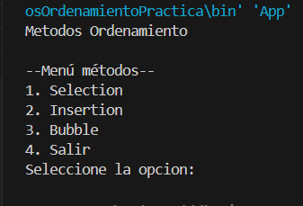

## Método Seleccion Con Pasos Ascendente

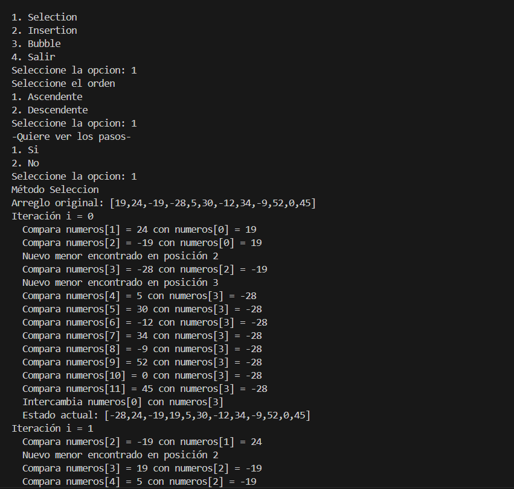

## Método Seleccion Sin Pasos Ascendente

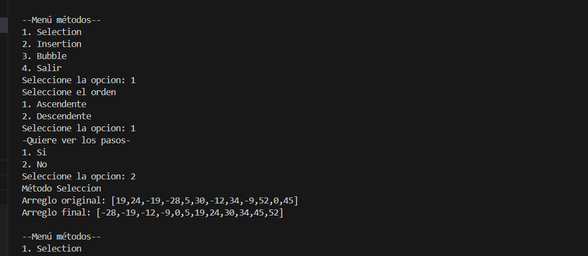

## Método Seleccion Con Pasos Descendente

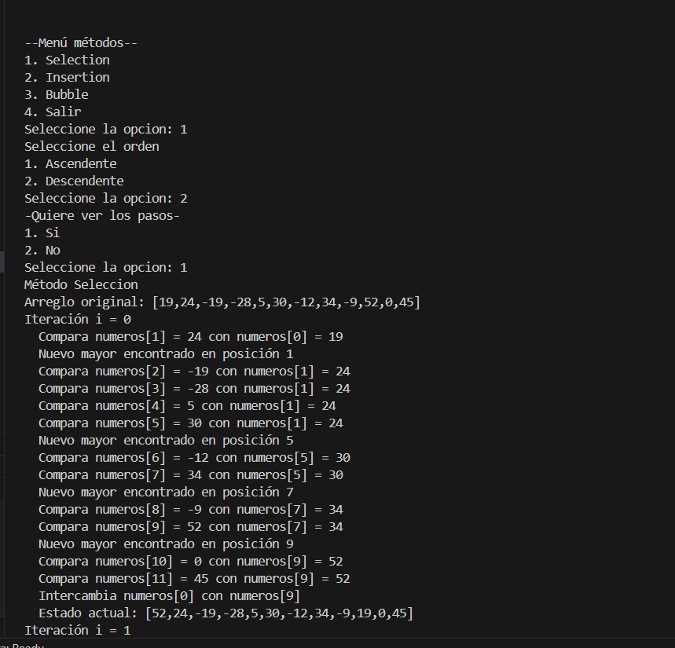

## Método Seleccion Sin Pasos Descendente

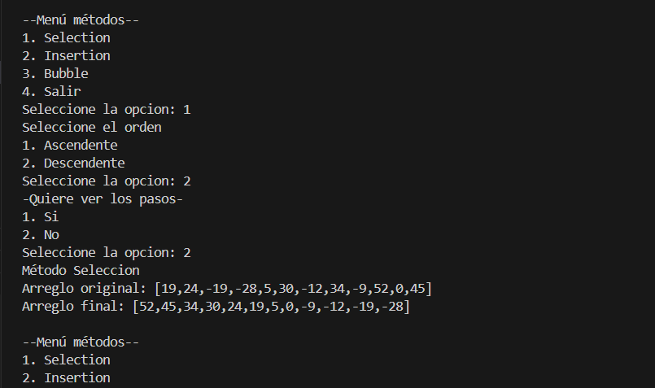

## Método Inserción Con Pasos Ascendente

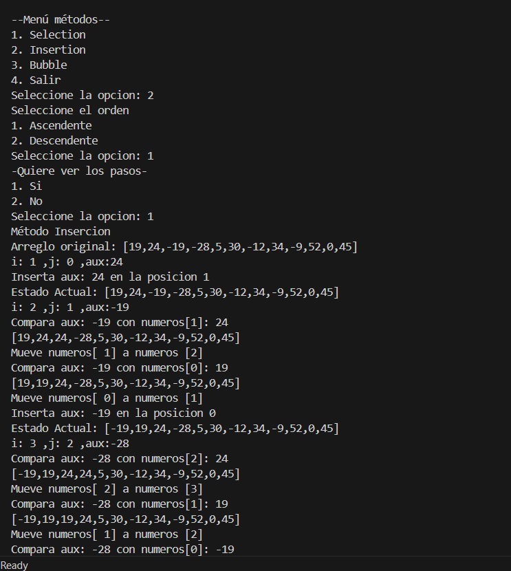

## Método Inserción Sin Pasos Ascendente

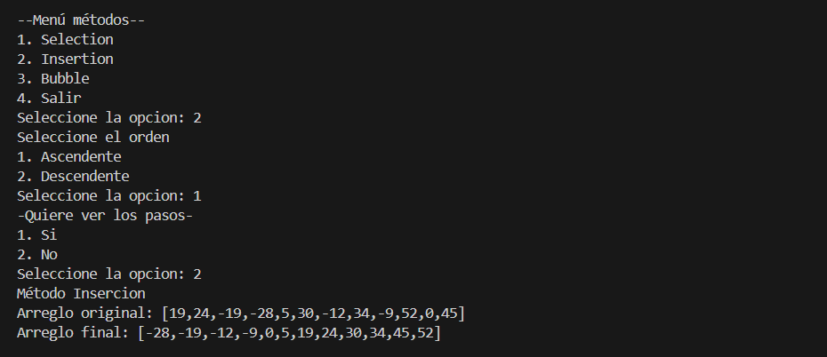

## Método Inserción Con Pasos Descendente

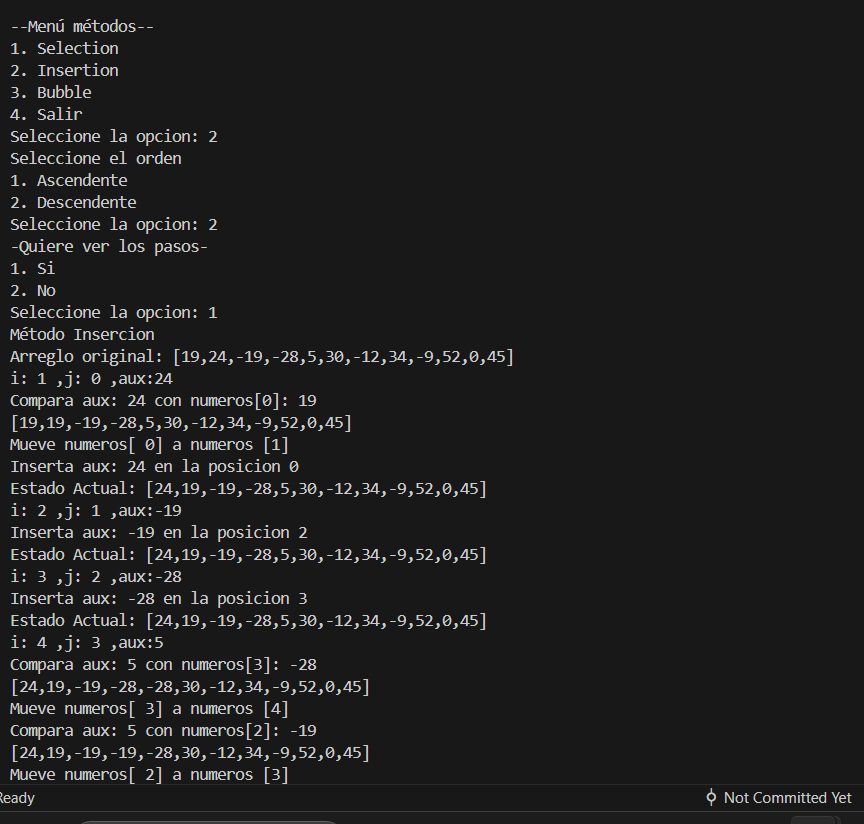

## Método Inserción Sin Pasos Descendente

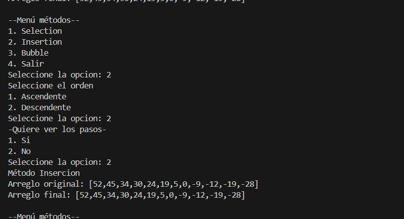

## Método Burbuja Con Pasos Ascendente

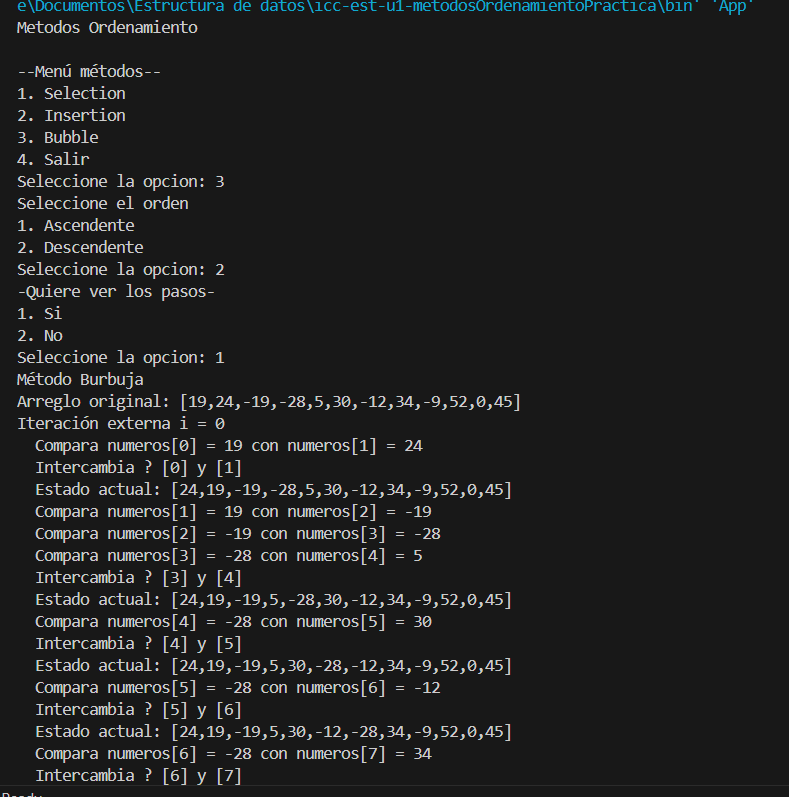

## Método Burbuja Sin Pasos Ascendente

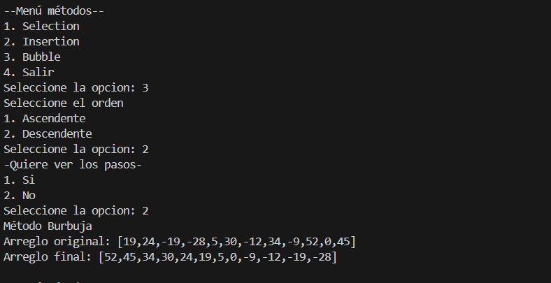

## Método Burbuja Con Pasos Descendente

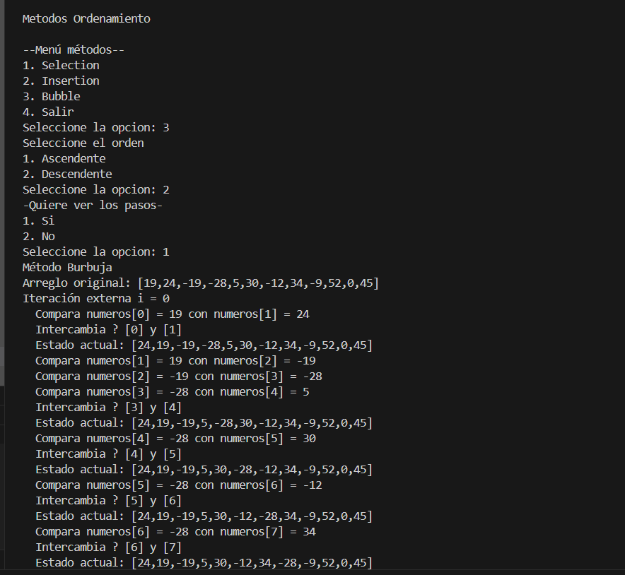

## Método Burbuja Sin Pasos Descendente

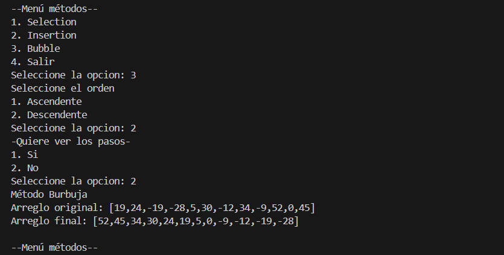

## Opción Salir

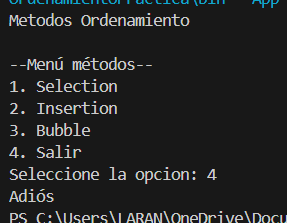
